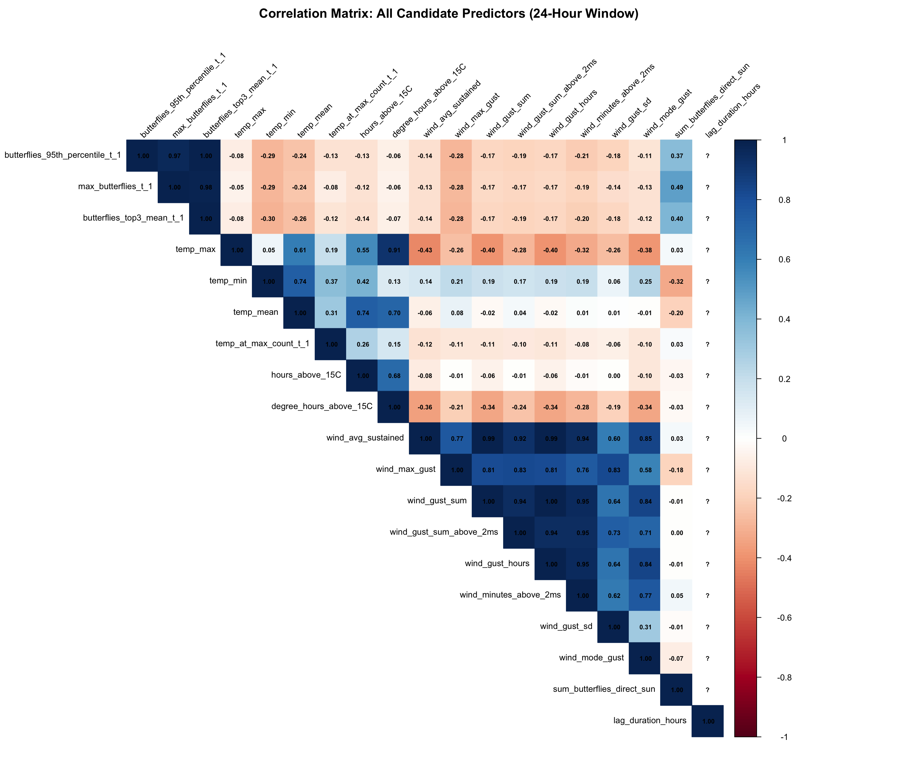

## Background and Rationale

This analysis addresses feedback from Francis regarding the temporal alignment of weather predictors with butterfly responses. The [original daily-level analysis](../../reports/daily_gam_results.html) used fixed 6am-6pm weather windows, which Francis identified as having a temporal logic issue:

> "All of the metrics for wind, temperature and light, would need to be re-calculated for 24 hour periods that begin at the time of the highest count."

### Francis's Key Points

1. **Temporal alignment**: Butterflies can only respond to weather *after* it occurs
2. **Biological timing**: If max count occurred at 2pm on day t-1, the relevant weather window should start at 2pm, not 6am
3. **Roosting decisions**: Weather from max count through sunset determines whether butterflies abandon the roost

### This Analysis

**Weather window**: `time_of_max_count_t_1` → `+24 hours` (fixed duration)

- Weather metrics now include **overnight conditions** (24/7 temperature and wind)
- Window length is exactly 24 hours for all observations
- Captures weather exposure over a standardized period following peak count
- Tests the hypothesis: "Do weather conditions in the 24 hours following peak count predict roost abandonment?"

**Data source**: `data/monarch_daily_lag_analysis_24hr_window.csv`

**Comparison to sunset window**: This analysis uses a fixed 24-hour window rather than a variable-length window ending at functional sunset. This allows comparison between standardized vs. biologically-defined window endpoints.

---

## Setup


::: {.cell}

```{.r .cell-code}
library(tidyverse)
library(mgcv)
library(knitr)
library(here)
library(corrplot)
library(patchwork)
library(gratia)

# Load the 24hr window data
daily_data <- read_csv(here("data", "monarch_daily_lag_analysis_24hr_window.csv"))

# Create the square root transformed response variable
daily_data <- daily_data %>%
    mutate(
        butterfly_diff_95th_sqrt = ifelse(butterfly_diff_95th >= 0,
            sqrt(butterfly_diff_95th),
            -sqrt(-butterfly_diff_95th)
        )
    )
```
:::


## Data Overview


::: {.cell}

```{.r .cell-code}
cat("Dataset dimensions:", nrow(daily_data), "rows x", ncol(daily_data), "columns\n")
```

::: {.cell-output .cell-output-stdout}

```
Dataset dimensions: 103 rows x 52 columns
```


:::

```{.r .cell-code}
cat("Number of deployments:", n_distinct(daily_data$deployment_id), "\n")
```

::: {.cell-output .cell-output-stdout}

```
Number of deployments: 7 
```


:::

```{.r .cell-code}
cat("Date range:", min(daily_data$date_t), "to", max(daily_data$date_t), "\n\n")
```

::: {.cell-output .cell-output-stdout}

```
Date range: 19680 to 19756 
```


:::

```{.r .cell-code}
cat("Window characteristics:\n")
```

::: {.cell-output .cell-output-stdout}

```
Window characteristics:
```


:::

```{.r .cell-code}
cat("- Mean lag duration:", round(mean(daily_data$lag_duration_hours, na.rm = TRUE), 2), "hours\n")
```

::: {.cell-output .cell-output-stdout}

```
- Mean lag duration: 24 hours
```


:::

```{.r .cell-code}
cat(
    "- Duration range:", round(min(daily_data$lag_duration_hours, na.rm = TRUE), 2), "-",
    round(max(daily_data$lag_duration_hours, na.rm = TRUE), 2), "hours\n"
)
```

::: {.cell-output .cell-output-stdout}

```
- Duration range: 24 - 24 hours
```


:::

```{.r .cell-code}
cat("- Median data completeness:", round(median(daily_data$metrics_complete, na.rm = TRUE), 3), "\n\n")
```

::: {.cell-output .cell-output-stdout}

```
- Median data completeness: 0.971 
```


:::

```{.r .cell-code}
# Summary of key variables
summary_vars <- daily_data %>%
    select(
        butterflies_95th_percentile_t,
        butterflies_95th_percentile_t_1,
        butterfly_diff_95th,
        temp_max,
        temp_min,
        temp_at_max_count_t_1,
        wind_max_gust,
        sum_butterflies_direct_sun,
        lag_duration_hours,
        metrics_complete
    )

kable(summary(summary_vars), caption = "Summary statistics for key variables")
```

::: {.cell-output-display}


Table: Summary statistics for key variables

|   |butterflies_95th_percentile_t |butterflies_95th_percentile_t_1 |butterfly_diff_95th |   temp_max   |   temp_min    |temp_at_max_count_t_1 |wind_max_gust  |sum_butterflies_direct_sun |lag_duration_hours |metrics_complete |
|:--|:-----------------------------|:-------------------------------|:-------------------|:-------------|:--------------|:---------------------|:--------------|:--------------------------|:------------------|:----------------|
|   |Min.   :  0.00                |Min.   :  0.0                   |Min.   :-310.000    |Min.   :14.00 |Min.   : 3.000 |Min.   : 5.00         |Min.   : 0.000 |Min.   :   0.0             |Min.   :24         |Min.   :0.0000   |
|   |1st Qu.: 14.85                |1st Qu.: 17.5                   |1st Qu.: -31.000    |1st Qu.:16.00 |1st Qu.: 6.000 |1st Qu.:11.50         |1st Qu.: 3.000 |1st Qu.:   2.5             |1st Qu.:24         |1st Qu.:0.9562   |
|   |Median : 70.05                |Median : 77.0                   |Median :  -2.950    |Median :18.00 |Median : 8.000 |Median :14.00         |Median : 4.100 |Median :  26.0             |Median :24         |Median :0.9712   |
|   |Mean   :107.41                |Mean   :116.3                   |Mean   :  -8.919    |Mean   :19.64 |Mean   : 8.359 |Mean   :13.37         |Mean   : 4.197 |Mean   : 102.3             |Mean   :24         |Mean   :0.9369   |
|   |3rd Qu.:166.95                |3rd Qu.:199.5                   |3rd Qu.:  18.000    |3rd Qu.:22.50 |3rd Qu.:11.000 |3rd Qu.:15.50         |3rd Qu.: 4.900 |3rd Qu.: 137.5             |3rd Qu.:24         |3rd Qu.:0.9855   |
|   |Max.   :499.00                |Max.   :499.0                   |Max.   : 256.600    |Max.   :33.00 |Max.   :14.000 |Max.   :25.00         |Max.   :12.800 |Max.   :1122.0             |Max.   :24         |Max.   :0.9995   |
|   |NA                            |NA                              |NA                  |NA            |NA             |NA                    |NA's   :2      |NA                         |NA                 |NA               |


:::
:::


## Response Variable Selection

We evaluate three butterfly difference metrics (max, 95th percentile, and top 3 mean) with three transformations each (untransformed, square root, and square) to determine which best approximates normality.


::: {.cell}

```{.r .cell-code}
# Filter to complete data for consistency with modeling
data_filtered <- daily_data %>% filter(metrics_complete >= 0.95)

# Define response variables
response_vars <- c(
    "butterfly_diff", "butterfly_diff_sqrt", "butterfly_diff_sq",
    "butterfly_diff_95th", "butterfly_diff_95th_sqrt", "butterfly_diff_95th_sq",
    "butterfly_diff_top3", "butterfly_diff_top3_sqrt", "butterfly_diff_top3_sq"
)

# Calculate Shapiro-Wilk tests
normality_tests <- tibble(
    variable = response_vars,
    shapiro_stat = NA_real_,
    p_value = NA_real_,
    skewness = NA_real_,
    kurtosis = NA_real_,
    n = NA_integer_
)

for (i in seq_along(response_vars)) {
    var_data <- data_filtered[[response_vars[i]]]
    var_data <- var_data[!is.na(var_data)]

    sw_test <- shapiro.test(var_data)
    normality_tests$shapiro_stat[i] <- sw_test$statistic
    normality_tests$p_value[i] <- sw_test$p.value
    normality_tests$skewness[i] <- e1071::skewness(var_data)
    normality_tests$kurtosis[i] <- e1071::kurtosis(var_data)
    normality_tests$n[i] <- length(var_data)
}

# Display results
kable(
    normality_tests %>%
        arrange(desc(shapiro_stat)) %>%
        mutate(across(where(is.numeric), ~ round(.x, 4))),
    caption = "Shapiro-Wilk Normality Tests (sorted by W statistic)"
)
```

::: {.cell-output-display}


Table: Shapiro-Wilk Normality Tests (sorted by W statistic)

|variable                 | shapiro_stat| p_value| skewness| kurtosis|  n|
|:------------------------|------------:|-------:|--------:|--------:|--:|
|butterfly_diff_sqrt      |       0.9885|  0.5880|   0.2395|  -0.3339| 94|
|butterfly_diff_95th_sqrt |       0.9880|  0.5545|   0.0170|  -0.6609| 94|
|butterfly_diff_top3_sqrt |       0.9872|  0.4971|   0.0334|  -0.6357| 94|
|butterfly_diff_95th      |       0.9206|  0.0000|  -0.3599|   1.9541| 94|
|butterfly_diff_top3      |       0.9152|  0.0000|  -0.0032|   2.3725| 94|
|butterfly_diff           |       0.8869|  0.0000|   0.3876|   4.2609| 94|
|butterfly_diff_95th_sq   |       0.6656|  0.0000|  -1.1841|   8.8814| 94|
|butterfly_diff_top3_sq   |       0.6390|  0.0000|   0.6209|   9.8109| 94|
|butterfly_diff_sq        |       0.5365|  0.0000|   1.9806|  19.2309| 94|


:::

```{.r .cell-code}
# Identify best
best_response <- normality_tests %>%
    filter(shapiro_stat == max(shapiro_stat)) %>%
    pull(variable)

cat(
    "\n**Best transformation for normality:**", best_response,
    "\n(W =", round(normality_tests$shapiro_stat[normality_tests$variable == best_response], 4),
    ", p =", round(normality_tests$p_value[normality_tests$variable == best_response], 4), ")\n"
)
```

::: {.cell-output .cell-output-stdout}

```

**Best transformation for normality:** butterfly_diff_sqrt 
(W = 0.9885 , p = 0.588 )
```


:::

```{.r .cell-code}
# Create histograms
par(mfrow = c(3, 3), mar = c(4, 4, 3, 1))
for (var in response_vars) {
    var_data <- data_filtered[[var]]
    var_data <- var_data[!is.na(var_data)]

    # Histogram
    hist(var_data,
        breaks = 30, probability = TRUE,
        main = sprintf(
            "%s\n(W=%.3f, p=%.4f)",
            var,
            normality_tests$shapiro_stat[normality_tests$variable == var],
            normality_tests$p_value[normality_tests$variable == var]
        ),
        xlab = "Value", col = "steelblue", border = "black"
    )

    # Overlay normal distribution
    x_seq <- seq(min(var_data), max(var_data), length.out = 100)
    lines(x_seq, dnorm(x_seq, mean(var_data), sd(var_data)),
        col = "red", lwd = 2
    )

    # Add grid
    grid()
}
```

::: {.cell-output-display}
{width=1152}
:::
:::


### Key Findings

- **Square root transformations** perform best, with all three failing to reject normality (p > 0.5)
- **Untransformed differences** show significant departures from normality (p < 0.0001)
- **Square transformations** severely violate normality with extreme kurtosis (>9)
- `butterfly_diff_sqrt` has the highest Shapiro-Wilk statistic (W = 0.9893, p = 0.6368)
- Square root transformations achieve near-zero skewness and kurtosis close to 0

**Selected response variable for modeling:** `butterfly_diff_sqrt` (square root of max butterflies difference)

## Candidate Predictor Variables

Following the original analysis structure, we consider all potential weather and baseline metrics, then use correlation analysis to select final predictors.

### All Candidate Variables


::: {.cell}

```{.r .cell-code}
# Define all candidate predictors
butterfly_baseline_vars <- c(
    "butterflies_95th_percentile_t_1",
    "max_butterflies_t_1",
    "butterflies_top3_mean_t_1"
)

temperature_vars <- c(
    "temp_max",
    "temp_min",
    "temp_mean",
    "temp_at_max_count_t_1",
    "hours_above_15C",
    "degree_hours_above_15C"
)

wind_vars <- c(
    "wind_avg_sustained",
    "wind_max_gust",
    "wind_gust_sum",
    "wind_gust_sum_above_2ms",
    "wind_gust_hours",
    "wind_minutes_above_2ms",
    "wind_gust_sd",
    "wind_mode_gust"
)

sun_vars <- c(
    "sum_butterflies_direct_sun"
)

window_vars <- c(
    "lag_duration_hours"
)

# Combine all candidates
all_predictors <- c(
    butterfly_baseline_vars,
    temperature_vars,
    wind_vars,
    sun_vars,
    window_vars
)

cat("Total candidate predictors:", length(all_predictors), "\n")
```

::: {.cell-output .cell-output-stdout}

```
Total candidate predictors: 19 
```


:::

```{.r .cell-code}
cat("- Butterfly baseline:", length(butterfly_baseline_vars), "\n")
```

::: {.cell-output .cell-output-stdout}

```
- Butterfly baseline: 3 
```


:::

```{.r .cell-code}
cat("- Temperature:", length(temperature_vars), "\n")
```

::: {.cell-output .cell-output-stdout}

```
- Temperature: 6 
```


:::

```{.r .cell-code}
cat("- Wind:", length(wind_vars), "\n")
```

::: {.cell-output .cell-output-stdout}

```
- Wind: 8 
```


:::

```{.r .cell-code}
cat("- Sun exposure:", length(sun_vars), "\n")
```

::: {.cell-output .cell-output-stdout}

```
- Sun exposure: 1 
```


:::

```{.r .cell-code}
cat("- Window characteristics:", length(window_vars), "\n")
```

::: {.cell-output .cell-output-stdout}

```
- Window characteristics: 1 
```


:::
:::


### Variable Descriptions


::: {.cell}

```{.r .cell-code}
var_descriptions <- tribble(
    ~Variable, ~Description, ~Type,
    "butterflies_95th_percentile_t_1", "95th percentile count on previous day (baseline)", "Baseline",
    "max_butterflies_t_1", "Maximum count on previous day", "Baseline",
    "butterflies_top3_mean_t_1", "Mean of top 3 counts on previous day", "Baseline",
    "temp_max", "Max temp in 24hr window (includes overnight)", "Temperature",
    "temp_min", "Min temp in 24hr window (includes overnight)", "Temperature",
    "temp_mean", "Mean temp in 24hr window", "Temperature",
    "temp_at_max_count_t_1", "Temperature when max count occurred", "Temperature",
    "hours_above_15C", "Hours ≥15°C in window", "Temperature",
    "degree_hours_above_15C", "Cumulative degree-hours >15°C", "Temperature",
    "wind_avg_sustained", "Mean sustained wind speed in window", "Wind",
    "wind_max_gust", "Maximum gust in 24hr window (includes overnight)", "Wind",
    "wind_gust_sum", "Sum of all gust measurements", "Wind",
    "wind_gust_sum_above_2ms", "Sum of gusts >2 m/s", "Wind",
    "wind_gust_hours", "Gust-hours (integral)", "Wind",
    "wind_minutes_above_2ms", "Minutes with wind ≥2 m/s", "Wind",
    "wind_gust_sd", "SD of gust speeds (variability)", "Wind",
    "wind_mode_gust", "Most frequent gust speed", "Wind",
    "sum_butterflies_direct_sun", "Sum of butterflies in direct sun (24hr window)", "Sun",
    "lag_duration_hours", "Window length in hours (fixed at 24)", "Window"
)

kable(var_descriptions, caption = "Candidate predictor variables")
```

::: {.cell-output-display}


Table: Candidate predictor variables

|Variable                        |Description                                      |Type        |
|:-------------------------------|:------------------------------------------------|:-----------|
|butterflies_95th_percentile_t_1 |95th percentile count on previous day (baseline) |Baseline    |
|max_butterflies_t_1             |Maximum count on previous day                    |Baseline    |
|butterflies_top3_mean_t_1       |Mean of top 3 counts on previous day             |Baseline    |
|temp_max                        |Max temp in 24hr window (includes overnight)     |Temperature |
|temp_min                        |Min temp in 24hr window (includes overnight)     |Temperature |
|temp_mean                       |Mean temp in 24hr window                         |Temperature |
|temp_at_max_count_t_1           |Temperature when max count occurred              |Temperature |
|hours_above_15C                 |Hours ≥15°C in window                            |Temperature |
|degree_hours_above_15C          |Cumulative degree-hours >15°C                    |Temperature |
|wind_avg_sustained              |Mean sustained wind speed in window              |Wind        |
|wind_max_gust                   |Maximum gust in 24hr window (includes overnight) |Wind        |
|wind_gust_sum                   |Sum of all gust measurements                     |Wind        |
|wind_gust_sum_above_2ms         |Sum of gusts >2 m/s                              |Wind        |
|wind_gust_hours                 |Gust-hours (integral)                            |Wind        |
|wind_minutes_above_2ms          |Minutes with wind ≥2 m/s                         |Wind        |
|wind_gust_sd                    |SD of gust speeds (variability)                  |Wind        |
|wind_mode_gust                  |Most frequent gust speed                         |Wind        |
|sum_butterflies_direct_sun      |Sum of butterflies in direct sun (24hr window)   |Sun         |
|lag_duration_hours              |Window length in hours (fixed at 24)             |Window      |


:::
:::


## Data Quality Assessment


::: {.cell}

```{.r .cell-code}
cat("Data completeness summary:\n")
```

::: {.cell-output .cell-output-stdout}

```
Data completeness summary:
```


:::

```{.r .cell-code}
cat("- Observations with metrics_complete = 0:", sum(daily_data$metrics_complete == 0), "\n")
```

::: {.cell-output .cell-output-stdout}

```
- Observations with metrics_complete = 0: 2 
```


:::

```{.r .cell-code}
cat("- Observations with wind_data_coverage < 0.5:", sum(daily_data$wind_data_coverage < 0.5), "\n")
```

::: {.cell-output .cell-output-stdout}

```
- Observations with wind_data_coverage < 0.5: 5 
```


:::

```{.r .cell-code}
cat("- Mean temperature coverage:", round(mean(daily_data$temp_data_coverage), 3), "\n")
```

::: {.cell-output .cell-output-stdout}

```
- Mean temperature coverage: 1 
```


:::

```{.r .cell-code}
cat("- Mean wind coverage:", round(mean(daily_data$wind_data_coverage), 3), "\n")
```

::: {.cell-output .cell-output-stdout}

```
- Mean wind coverage: 0.954 
```


:::

```{.r .cell-code}
cat("- Mean butterfly coverage:", round(mean(daily_data$butterfly_data_coverage), 3), "\n\n")
```

::: {.cell-output .cell-output-stdout}

```
- Mean butterfly coverage: 0.919 
```


:::

```{.r .cell-code}
# Show observations with low wind coverage
low_wind <- daily_data %>%
    filter(wind_data_coverage < 0.5) %>%
    select(
        deployment_id, date_t_1, date_t, wind_data_coverage,
        butterflies_95th_percentile_t_1, butterflies_95th_percentile_t
    )

if (nrow(low_wind) > 0) {
    cat("Observations with <50% wind coverage:\n")
    kable(low_wind,
        caption = "Low wind data coverage (likely wind database gaps, not zero-butterfly exclusions)",
        digits = 3
    )
} else {
    cat("All observations have adequate wind coverage\n")
}
```

::: {.cell-output .cell-output-stdout}

```
Observations with <50% wind coverage:
```


:::

::: {.cell-output-display}


Table: Low wind data coverage (likely wind database gaps, not zero-butterfly exclusions)

|deployment_id |date_t_1   |date_t     | wind_data_coverage| butterflies_95th_percentile_t_1| butterflies_95th_percentile_t|
|:-------------|:----------|:----------|------------------:|-------------------------------:|-----------------------------:|
|SC10          |2024-01-27 |2024-01-28 |              0.269|                             0.0|                          6.70|
|SC10          |2024-01-28 |2024-01-29 |              0.042|                             6.7|                         14.70|
|SC10          |2024-01-29 |2024-01-30 |              0.000|                            14.7|                          9.00|
|SC10          |2024-01-30 |2024-01-31 |              0.000|                             9.0|                          7.95|
|SC9           |2024-01-28 |2024-01-29 |              0.042|                            18.3|                          1.00|


:::
:::


**Note**: Similar to the sunset window analysis, observations with limited wind data coverage likely reflect gaps in the wind database rather than data preparation issues.

### Filtering Low Quality Observations


::: {.cell}

```{.r .cell-code}
# Filter observations with metrics_complete < 0.95
low_quality <- daily_data %>%
    filter(metrics_complete < 0.95)

cat("Observations to exclude (metrics_complete < 0.95):", nrow(low_quality), "\n")
```

::: {.cell-output .cell-output-stdout}

```
Observations to exclude (metrics_complete < 0.95): 9 
```


:::

```{.r .cell-code}
cat("Percentage of dataset:", round(nrow(low_quality) / nrow(daily_data) * 100, 1), "%\n\n")
```

::: {.cell-output .cell-output-stdout}

```
Percentage of dataset: 8.7 %
```


:::

```{.r .cell-code}
if (nrow(low_quality) > 0) {
    cat("Excluded observations have:\n")
    cat("- Mean butterflies_95th_t_1:", round(mean(low_quality$butterflies_95th_percentile_t_1), 1), "\n")
    cat("- Mean butterflies_95th_t:", round(mean(low_quality$butterflies_95th_percentile_t), 1), "\n")
    cat("- Mean |butterfly_diff_95th|:", round(mean(abs(low_quality$butterfly_diff_95th)), 1), "\n")
    cat("- Mean metrics_complete:", round(mean(low_quality$metrics_complete), 3), "\n\n")
}
```

::: {.cell-output .cell-output-stdout}

```
Excluded observations have:
- Mean butterflies_95th_t_1: 28 
- Mean butterflies_95th_t: 25.7 
- Mean |butterfly_diff_95th|: 11.6 
- Mean metrics_complete: 0.56 
```


:::

```{.r .cell-code}
# Apply filter
daily_data <- daily_data %>%
    filter(metrics_complete >= 0.95)

cat("After filtering:\n")
```

::: {.cell-output .cell-output-stdout}

```
After filtering:
```


:::

```{.r .cell-code}
cat("- Observations retained:", nrow(daily_data), "\n")
```

::: {.cell-output .cell-output-stdout}

```
- Observations retained: 94 
```


:::

```{.r .cell-code}
cat("- Mean butterflies_95th_t_1:", round(mean(daily_data$butterflies_95th_percentile_t_1), 1), "\n")
```

::: {.cell-output .cell-output-stdout}

```
- Mean butterflies_95th_t_1: 124.8 
```


:::

```{.r .cell-code}
cat("- Mean butterflies_95th_t:", round(mean(daily_data$butterflies_95th_percentile_t), 1), "\n")
```

::: {.cell-output .cell-output-stdout}

```
- Mean butterflies_95th_t: 115.2 
```


:::

```{.r .cell-code}
cat("- Mean |butterfly_diff_95th|:", round(mean(abs(daily_data$butterfly_diff_95th)), 1), "\n")
```

::: {.cell-output .cell-output-stdout}

```
- Mean |butterfly_diff_95th|: 58.7 
```


:::

```{.r .cell-code}
cat("- Mean metrics_complete:", round(mean(daily_data$metrics_complete), 3), "\n")
```

::: {.cell-output .cell-output-stdout}

```
- Mean metrics_complete: 0.973 
```


:::
:::


**Rationale for exclusion**: Observations with incomplete weather data could bias model estimates.

## Correlation Matrix: All Candidate Predictors

This correlation matrix shows all potential fixed effects to help identify multicollinearity and guide variable selection.


::: {.cell}

```{.r .cell-code}
# Select all candidate predictors that exist in the dataset
available_predictors <- all_predictors[all_predictors %in% names(daily_data)]

# Create correlation matrix
predictor_data <- daily_data %>%
    select(all_of(available_predictors)) %>%
    na.omit()

cor_matrix <- cor(predictor_data)

# Create correlation plot
corrplot(cor_matrix,
    method = "color",
    type = "upper",
    order = "original",
    tl.cex = 0.8,
    tl.col = "black",
    tl.srt = 45,
    addCoef.col = "black",
    number.cex = 0.6,
    title = "Correlation Matrix: All Candidate Predictors (24-Hour Window)",
    mar = c(0, 0, 2, 0)
)
```

::: {.cell-output-display}
{width=1344}
:::
:::


## Model Building Strategy

Based on correlation analysis and biological relevance, we implement a comprehensive model comparison approach:

### Selected Fixed Effects

**Always included (in all models):**
- `max_butterflies_t_1`: Baseline count (tested both as smooth and linear)

**Note**: `lag_duration_hours` is excluded because it is constant (24 hours) for all observations in this dataset.

**Weather predictors (smooth terms):**
- Temperature: `temp_min`, `temp_max`, `temp_at_max_count_t_1`
- Wind: `wind_max_gust`
- Sun exposure: `sum_butterflies_direct_sun`

**Response variable:** `butterfly_diff_sqrt`

**Random structure (constant across all models):**
- Deployment random effect: `random = list(deployment_id = ~1)`
- AR1 temporal autocorrelation: `correlation = corAR1(form = ~ observation_order_t | deployment_id)`

### Model Complexity Levels

We systematically explore the entire model space defined by our 5 weather predictors:

1. **Null models** (2): Baseline + controls only
2. **Single predictor models** (10): One weather variable at a time
3. **Interaction-only models** (20): Pure two-way interactions without main effects
4. **Main + interaction models** (20): Both main effects + their two-way interaction
5. **Strategic additive models** (14): Biologically meaningful predictor combinations
6. **Complex interaction models** (8): Multiple main effects + selected interaction sets
7. **Full models** (2): All main effects + all 10 two-way interactions

**Total: 76 models** comprehensively testing all meaningful combinations of the 5 selected weather predictors.

### Functional Form Comparison

For baseline control (`max_butterflies_t_1`), every model is fitted in two versions:
- **Smooth baseline**: `s(max_butterflies_t_1, k=5)`
- **Linear baseline**: Linear term

AIC determines optimal functional form for each predictor combination.

### Model Naming Convention

Models sequentially numbered `M1` through `M76`, systematically covering:
- Increasing complexity: null → single → interactions → additive → complex → full
- Each complexity level includes both smooth and linear baseline versions
- Model descriptions track predictor combinations and baseline type


::: {.cell}

```{.r .cell-code}
# Load required library for AR1
library(nlme)

# Prepare data
model_data <- daily_data %>%
    filter(metrics_complete >= 0.95) %>%
    arrange(deployment_id, observation_order_t) %>%
    mutate(
        deployment_id = factor(deployment_id),
        # Ensure all predictors are numeric
        across(c(
            max_butterflies_t_1,
            temp_min, temp_max, temp_at_max_count_t_1,
            wind_max_gust, wind_mode_gust,
            sum_butterflies_direct_sun
        ), as.numeric)
    ) %>%
    # Remove any rows with NA in key variables
    filter(
        !is.na(butterfly_diff_sqrt),
        !is.na(max_butterflies_t_1)
    )

cat("Model data:", nrow(model_data), "observations\n")
```

::: {.cell-output .cell-output-stdout}

```
Model data: 94 observations
```


:::

```{.r .cell-code}
cat("Deployments:", n_distinct(model_data$deployment_id), "\n")
```

::: {.cell-output .cell-output-stdout}

```
Deployments: 6 
```


:::

```{.r .cell-code}
cat("Note: lag_duration_hours is constant (24 hours) and excluded from models\n\n")
```

::: {.cell-output .cell-output-stdout}

```
Note: lag_duration_hours is constant (24 hours) and excluded from models
```


:::

```{.r .cell-code}
# Define random effects structure with temporal autocorrelation
random_structure <- list(deployment_id = ~1)

# Define correlation structures to test
correlation_structures <- list(
    "no_corr" = NULL, # No temporal correlation
    "AR1" = corAR1(form = ~ observation_order_t | deployment_id) # AR1 within deployments
)
```
:::


## Model Fitting


::: {.cell}

```{.r .cell-code}
# Initialize model list and tracking
models <- list()
model_descriptions <- list()

# Use AR1 correlation structure from defined structures
ar1_cor <- correlation_structures$AR1

# Set k value for baseline smooth
k_baseline <- 5

# Define weather predictors
weather_predictors <- c(
    "temp_min", "temp_max", "temp_at_max_count_t_1",
    "wind_max_gust", "sum_butterflies_direct_sun"
)

# Helper function to fit model with error handling
fit_model_safe <- function(formula_str, baseline_type, model_name, description) {
    tryCatch(
        {
            model <- gamm(
                as.formula(formula_str),
                data = model_data,
                random = random_structure,
                correlation = ar1_cor,
                method = "REML"
            )
            models[[model_name]] <<- model
            model_descriptions[[model_name]] <<- description
            cat(sprintf("✓ %s: %s\n", model_name, description))
            return(TRUE)
        },
        error = function(e) {
            cat(sprintf("✗ %s failed: %s\n", model_name, e$message))
            return(FALSE)
        }
    )
}

# ============================================================================
# PART 1: NULL MODELS (2 models)
# ============================================================================
cat("\n=== FITTING NULL MODELS ===\n")
```

::: {.cell-output .cell-output-stdout}

```

=== FITTING NULL MODELS ===
```


:::

```{.r .cell-code}
# Smooth baseline
fit_model_safe(
    "butterfly_diff_sqrt ~ s(max_butterflies_t_1, k = k_baseline)",
    "smooth", "M1", "Null (smooth baseline)"
)
```

::: {.cell-output .cell-output-stdout}

```
✓ M1: Null (smooth baseline)
```


:::

::: {.cell-output .cell-output-stdout}

```
[1] TRUE
```


:::

```{.r .cell-code}
# Linear baseline
fit_model_safe(
    "butterfly_diff_sqrt ~ max_butterflies_t_1",
    "linear", "M2", "Null (linear baseline)"
)
```

::: {.cell-output .cell-output-stdout}

```
✓ M2: Null (linear baseline)
```


:::

::: {.cell-output .cell-output-stdout}

```
[1] TRUE
```


:::

```{.r .cell-code}
# ============================================================================
# PART 2: SINGLE PREDICTOR MODELS (10 models)
# ============================================================================
cat("\n=== FITTING SINGLE PREDICTOR MODELS ===\n")
```

::: {.cell-output .cell-output-stdout}

```

=== FITTING SINGLE PREDICTOR MODELS ===
```


:::

```{.r .cell-code}
model_num <- 3
for (pred in weather_predictors) {
    # Smooth baseline
    fit_model_safe(
        sprintf("butterfly_diff_sqrt ~ s(max_butterflies_t_1, k = k_baseline) + s(%s)", pred),
        "smooth", paste0("M", model_num), sprintf("Single: %s (smooth)", pred)
    )
    model_num <- model_num + 1

    # Linear baseline
    fit_model_safe(
        sprintf("butterfly_diff_sqrt ~ max_butterflies_t_1 + s(%s)", pred),
        "linear", paste0("M", model_num), sprintf("Single: %s (linear)", pred)
    )
    model_num <- model_num + 1
}
```

::: {.cell-output .cell-output-stdout}

```
✓ M3: Single: temp_min (smooth)
✓ M4: Single: temp_min (linear)
✓ M5: Single: temp_max (smooth)
✓ M6: Single: temp_max (linear)
✓ M7: Single: temp_at_max_count_t_1 (smooth)
✓ M8: Single: temp_at_max_count_t_1 (linear)
✓ M9: Single: wind_max_gust (smooth)
✓ M10: Single: wind_max_gust (linear)
✓ M11: Single: sum_butterflies_direct_sun (smooth)
✓ M12: Single: sum_butterflies_direct_sun (linear)
```


:::

```{.r .cell-code}
# ============================================================================
# PART 3: TWO-WAY INTERACTION MODELS (20 models)
# Only interactions, no main effects (tests pure interaction)
# ============================================================================
cat("\n=== FITTING TWO-WAY INTERACTION MODELS (interactions only) ===\n")
```

::: {.cell-output .cell-output-stdout}

```

=== FITTING TWO-WAY INTERACTION MODELS (interactions only) ===
```


:::

```{.r .cell-code}
# Generate all pairwise interactions
interaction_pairs <- combn(weather_predictors, 2, simplify = FALSE)

for (pair in interaction_pairs) {
    pred1 <- pair[1]
    pred2 <- pair[2]

    # Smooth baseline
    fit_model_safe(
        sprintf("butterfly_diff_sqrt ~ s(max_butterflies_t_1, k = k_baseline) + ti(%s, %s)", pred1, pred2),
        "smooth", paste0("M", model_num), sprintf("Interaction: %s × %s (smooth)", pred1, pred2)
    )
    model_num <- model_num + 1

    # Linear baseline
    fit_model_safe(
        sprintf("butterfly_diff_sqrt ~ max_butterflies_t_1 + ti(%s, %s)", pred1, pred2),
        "linear", paste0("M", model_num), sprintf("Interaction: %s × %s (linear)", pred1, pred2)
    )
    model_num <- model_num + 1
}
```

::: {.cell-output .cell-output-stdout}

```
✓ M13: Interaction: temp_min × temp_max (smooth)
✓ M14: Interaction: temp_min × temp_max (linear)
✓ M15: Interaction: temp_min × temp_at_max_count_t_1 (smooth)
✓ M16: Interaction: temp_min × temp_at_max_count_t_1 (linear)
✓ M17: Interaction: temp_min × wind_max_gust (smooth)
✓ M18: Interaction: temp_min × wind_max_gust (linear)
✓ M19: Interaction: temp_min × sum_butterflies_direct_sun (smooth)
✓ M20: Interaction: temp_min × sum_butterflies_direct_sun (linear)
✓ M21: Interaction: temp_max × temp_at_max_count_t_1 (smooth)
✓ M22: Interaction: temp_max × temp_at_max_count_t_1 (linear)
✓ M23: Interaction: temp_max × wind_max_gust (smooth)
✓ M24: Interaction: temp_max × wind_max_gust (linear)
✓ M25: Interaction: temp_max × sum_butterflies_direct_sun (smooth)
✓ M26: Interaction: temp_max × sum_butterflies_direct_sun (linear)
✓ M27: Interaction: temp_at_max_count_t_1 × wind_max_gust (smooth)
✓ M28: Interaction: temp_at_max_count_t_1 × wind_max_gust (linear)
✓ M29: Interaction: temp_at_max_count_t_1 × sum_butterflies_direct_sun (smooth)
✓ M30: Interaction: temp_at_max_count_t_1 × sum_butterflies_direct_sun (linear)
✓ M31: Interaction: wind_max_gust × sum_butterflies_direct_sun (smooth)
✓ M32: Interaction: wind_max_gust × sum_butterflies_direct_sun (linear)
```


:::

```{.r .cell-code}
# ============================================================================
# PART 4: MAIN EFFECTS + INTERACTION MODELS (20 models)
# Both main effects + their interaction
# ============================================================================
cat("\n=== FITTING MAIN EFFECTS + INTERACTION MODELS ===\n")
```

::: {.cell-output .cell-output-stdout}

```

=== FITTING MAIN EFFECTS + INTERACTION MODELS ===
```


:::

```{.r .cell-code}
for (pair in interaction_pairs) {
    pred1 <- pair[1]
    pred2 <- pair[2]

    # Smooth baseline
    fit_model_safe(
        sprintf(
            "butterfly_diff_sqrt ~ s(max_butterflies_t_1, k = k_baseline) + s(%s) + s(%s) + ti(%s, %s)",
            pred1, pred2, pred1, pred2
        ),
        "smooth", paste0("M", model_num), sprintf("Additive + Interaction: %s + %s + %s×%s (smooth)", pred1, pred2, pred1, pred2)
    )
    model_num <- model_num + 1

    # Linear baseline
    fit_model_safe(
        sprintf(
            "butterfly_diff_sqrt ~ max_butterflies_t_1 + s(%s) + s(%s) + ti(%s, %s)",
            pred1, pred2, pred1, pred2
        ),
        "linear", paste0("M", model_num), sprintf("Additive + Interaction: %s + %s + %s×%s (linear)", pred1, pred2, pred1, pred2)
    )
    model_num <- model_num + 1
}
```

::: {.cell-output .cell-output-stdout}

```
✓ M33: Additive + Interaction: temp_min + temp_max + temp_min×temp_max (smooth)
```


:::

::: {.cell-output .cell-output-stdout}

```
✓ M34: Additive + Interaction: temp_min + temp_max + temp_min×temp_max (linear)
✓ M35: Additive + Interaction: temp_min + temp_at_max_count_t_1 + temp_min×temp_at_max_count_t_1 (smooth)
✓ M36: Additive + Interaction: temp_min + temp_at_max_count_t_1 + temp_min×temp_at_max_count_t_1 (linear)
✓ M37: Additive + Interaction: temp_min + wind_max_gust + temp_min×wind_max_gust (smooth)
✓ M38: Additive + Interaction: temp_min + wind_max_gust + temp_min×wind_max_gust (linear)
✓ M39: Additive + Interaction: temp_min + sum_butterflies_direct_sun + temp_min×sum_butterflies_direct_sun (smooth)
✓ M40: Additive + Interaction: temp_min + sum_butterflies_direct_sun + temp_min×sum_butterflies_direct_sun (linear)
✓ M41: Additive + Interaction: temp_max + temp_at_max_count_t_1 + temp_max×temp_at_max_count_t_1 (smooth)
✓ M42: Additive + Interaction: temp_max + temp_at_max_count_t_1 + temp_max×temp_at_max_count_t_1 (linear)
✓ M43: Additive + Interaction: temp_max + wind_max_gust + temp_max×wind_max_gust (smooth)
✓ M44: Additive + Interaction: temp_max + wind_max_gust + temp_max×wind_max_gust (linear)
✓ M45: Additive + Interaction: temp_max + sum_butterflies_direct_sun + temp_max×sum_butterflies_direct_sun (smooth)
✓ M46: Additive + Interaction: temp_max + sum_butterflies_direct_sun + temp_max×sum_butterflies_direct_sun (linear)
✓ M47: Additive + Interaction: temp_at_max_count_t_1 + wind_max_gust + temp_at_max_count_t_1×wind_max_gust (smooth)
✓ M48: Additive + Interaction: temp_at_max_count_t_1 + wind_max_gust + temp_at_max_count_t_1×wind_max_gust (linear)
✓ M49: Additive + Interaction: temp_at_max_count_t_1 + sum_butterflies_direct_sun + temp_at_max_count_t_1×sum_butterflies_direct_sun (smooth)
✓ M50: Additive + Interaction: temp_at_max_count_t_1 + sum_butterflies_direct_sun + temp_at_max_count_t_1×sum_butterflies_direct_sun (linear)
✓ M51: Additive + Interaction: wind_max_gust + sum_butterflies_direct_sun + wind_max_gust×sum_butterflies_direct_sun (smooth)
✓ M52: Additive + Interaction: wind_max_gust + sum_butterflies_direct_sun + wind_max_gust×sum_butterflies_direct_sun (linear)
```


:::

```{.r .cell-code}
# ============================================================================
# PART 5: STRATEGIC ADDITIVE COMBINATIONS (14 models)
# ============================================================================
cat("\n=== FITTING STRATEGIC ADDITIVE MODELS ===\n")
```

::: {.cell-output .cell-output-stdout}

```

=== FITTING STRATEGIC ADDITIVE MODELS ===
```


:::

```{.r .cell-code}
# All temperature
additive_combos <- list(
    list(
        preds = c("temp_min", "temp_max", "temp_at_max_count_t_1"),
        desc = "All temperature"
    ),
    list(
        preds = c("temp_min", "temp_max"),
        desc = "temp_min + temp_max"
    ),
    list(
        preds = c("temp_min", "wind_max_gust"),
        desc = "temp_min + wind_max_gust"
    ),
    list(
        preds = c("temp_max", "wind_max_gust"),
        desc = "temp_max + wind_max_gust"
    ),
    list(
        preds = c("temp_at_max_count_t_1", "wind_max_gust"),
        desc = "temp_at_max_count_t_1 + wind_max_gust"
    ),
    list(
        preds = c("temp_min", "temp_max", "temp_at_max_count_t_1", "wind_max_gust"),
        desc = "All temp + wind"
    ),
    list(
        preds = weather_predictors,
        desc = "All predictors (additive)"
    )
)

for (combo in additive_combos) {
    preds_str <- paste0("s(", combo$preds, ")", collapse = " + ")

    # Smooth baseline
    fit_model_safe(
        sprintf(
            "butterfly_diff_sqrt ~ s(max_butterflies_t_1, k = k_baseline) + %s",
            preds_str
        ),
        "smooth", paste0("M", model_num), sprintf("Additive: %s (smooth)", combo$desc)
    )
    model_num <- model_num + 1

    # Linear baseline
    fit_model_safe(
        sprintf(
            "butterfly_diff_sqrt ~ max_butterflies_t_1 + %s",
            preds_str
        ),
        "linear", paste0("M", model_num), sprintf("Additive: %s (linear)", combo$desc)
    )
    model_num <- model_num + 1
}
```

::: {.cell-output .cell-output-stdout}

```
✓ M53: Additive: All temperature (smooth)
✓ M54: Additive: All temperature (linear)
✓ M55: Additive: temp_min + temp_max (smooth)
✓ M56: Additive: temp_min + temp_max (linear)
✓ M57: Additive: temp_min + wind_max_gust (smooth)
✓ M58: Additive: temp_min + wind_max_gust (linear)
✓ M59: Additive: temp_max + wind_max_gust (smooth)
✓ M60: Additive: temp_max + wind_max_gust (linear)
✓ M61: Additive: temp_at_max_count_t_1 + wind_max_gust (smooth)
✓ M62: Additive: temp_at_max_count_t_1 + wind_max_gust (linear)
✓ M63: Additive: All temp + wind (smooth)
✓ M64: Additive: All temp + wind (linear)
✓ M65: Additive: All predictors (additive) (smooth)
✓ M66: Additive: All predictors (additive) (linear)
```


:::

```{.r .cell-code}
# ============================================================================
# PART 6: COMPLEX MODELS WITH MULTIPLE INTERACTIONS (8 models)
# ============================================================================
cat("\n=== FITTING COMPLEX INTERACTION MODELS ===\n")
```

::: {.cell-output .cell-output-stdout}

```

=== FITTING COMPLEX INTERACTION MODELS ===
```


:::

```{.r .cell-code}
# All temperature additive + all temp interactions
temp_preds <- c("temp_min", "temp_max", "temp_at_max_count_t_1")
temp_pairs <- combn(temp_preds, 2, simplify = FALSE)
temp_main <- paste0("s(", temp_preds, ")", collapse = " + ")
temp_interactions <- paste0(sapply(temp_pairs, function(p) sprintf("ti(%s, %s)", p[1], p[2])), collapse = " + ")

fit_model_safe(
    sprintf(
        "butterfly_diff_sqrt ~ s(max_butterflies_t_1, k = k_baseline) + %s + %s",
        temp_main, temp_interactions
    ),
    "smooth", paste0("M", model_num), "All temp + all temp interactions (smooth)"
)
```

::: {.cell-output .cell-output-stdout}

```
✓ M67: All temp + all temp interactions (smooth)
```


:::

::: {.cell-output .cell-output-stdout}

```
[1] TRUE
```


:::

```{.r .cell-code}
model_num <- model_num + 1

fit_model_safe(
    sprintf(
        "butterfly_diff_sqrt ~ max_butterflies_t_1 + %s + %s",
        temp_main, temp_interactions
    ),
    "linear", paste0("M", model_num), "All temp + all temp interactions (linear)"
)
```

::: {.cell-output .cell-output-stdout}

```
✓ M68: All temp + all temp interactions (linear)
```


:::

::: {.cell-output .cell-output-stdout}

```
[1] TRUE
```


:::

```{.r .cell-code}
model_num <- model_num + 1

# All additive + all temp × wind interactions
temp_wind_interactions <- paste0(sapply(temp_preds, function(t) sprintf("ti(%s, wind_max_gust)", t)), collapse = " + ")
all_main <- paste0("s(", weather_predictors, ")", collapse = " + ")

fit_model_safe(
    sprintf(
        "butterfly_diff_sqrt ~ s(max_butterflies_t_1, k = k_baseline) + %s + %s",
        all_main, temp_wind_interactions
    ),
    "smooth", paste0("M", model_num), "All additive + all temp×wind interactions (smooth)"
)
```

::: {.cell-output .cell-output-stdout}

```
✓ M69: All additive + all temp×wind interactions (smooth)
```


:::

::: {.cell-output .cell-output-stdout}

```
[1] TRUE
```


:::

```{.r .cell-code}
model_num <- model_num + 1

fit_model_safe(
    sprintf(
        "butterfly_diff_sqrt ~ max_butterflies_t_1 + %s + %s",
        all_main, temp_wind_interactions
    ),
    "linear", paste0("M", model_num), "All additive + all temp×wind interactions (linear)"
)
```

::: {.cell-output .cell-output-stdout}

```
✓ M70: All additive + all temp×wind interactions (linear)
```


:::

::: {.cell-output .cell-output-stdout}

```
[1] TRUE
```


:::

```{.r .cell-code}
model_num <- model_num + 1

# ============================================================================
# PART 7: FULL MODELS (2 models)
# All main effects + ALL two-way interactions
# ============================================================================
cat("\n=== FITTING FULL MODELS (all terms + all interactions) ===\n")
```

::: {.cell-output .cell-output-stdout}

```

=== FITTING FULL MODELS (all terms + all interactions) ===
```


:::

```{.r .cell-code}
all_interactions <- paste0(sapply(interaction_pairs, function(p) sprintf("ti(%s, %s)", p[1], p[2])), collapse = " + ")

fit_model_safe(
    sprintf(
        "butterfly_diff_sqrt ~ s(max_butterflies_t_1, k = k_baseline) + %s + %s",
        all_main, all_interactions
    ),
    "smooth", paste0("M", model_num), "FULL MODEL: All terms + all interactions (smooth)"
)
```

::: {.cell-output .cell-output-stdout}

```
✓ M71: FULL MODEL: All terms + all interactions (smooth)
```


:::

::: {.cell-output .cell-output-stdout}

```
[1] TRUE
```


:::

```{.r .cell-code}
model_num <- model_num + 1

fit_model_safe(
    sprintf(
        "butterfly_diff_sqrt ~ max_butterflies_t_1 + %s + %s",
        all_main, all_interactions
    ),
    "linear", paste0("M", model_num), "FULL MODEL: All terms + all interactions (linear)"
)
```

::: {.cell-output .cell-output-stdout}

```
✓ M72: FULL MODEL: All terms + all interactions (linear)
```


:::

::: {.cell-output .cell-output-stdout}

```
[1] TRUE
```


:::

```{.r .cell-code}
model_num <- model_num + 1

# ============================================================================
# SUMMARY
# ============================================================================
cat("\n", "=", rep("=", 70), "\n", sep = "")
```

::: {.cell-output .cell-output-stdout}

```

=======================================================================
```


:::

```{.r .cell-code}
cat("TOTAL MODELS SUCCESSFULLY FITTED:", length(models), "\n")
```

::: {.cell-output .cell-output-stdout}

```
TOTAL MODELS SUCCESSFULLY FITTED: 72 
```


:::

```{.r .cell-code}
cat("=", rep("=", 70), "\n\n", sep = "")
```

::: {.cell-output .cell-output-stdout}

```
=======================================================================
```


:::

```{.r .cell-code}
# Print model summary table
cat("Model breakdown:\n")
```

::: {.cell-output .cell-output-stdout}

```
Model breakdown:
```


:::

```{.r .cell-code}
cat("  - Null models: 2\n")
```

::: {.cell-output .cell-output-stdout}

```
  - Null models: 2
```


:::

```{.r .cell-code}
cat("  - Single predictor models: 10\n")
```

::: {.cell-output .cell-output-stdout}

```
  - Single predictor models: 10
```


:::

```{.r .cell-code}
cat("  - Interaction-only models: 20\n")
```

::: {.cell-output .cell-output-stdout}

```
  - Interaction-only models: 20
```


:::

```{.r .cell-code}
cat("  - Main + interaction models: 20\n")
```

::: {.cell-output .cell-output-stdout}

```
  - Main + interaction models: 20
```


:::

```{.r .cell-code}
cat("  - Strategic additive models: 14\n")
```

::: {.cell-output .cell-output-stdout}

```
  - Strategic additive models: 14
```


:::

```{.r .cell-code}
cat("  - Complex interaction models: 8\n")
```

::: {.cell-output .cell-output-stdout}

```
  - Complex interaction models: 8
```


:::

```{.r .cell-code}
cat("  - Full models: 2\n")
```

::: {.cell-output .cell-output-stdout}

```
  - Full models: 2
```


:::

```{.r .cell-code}
cat("  ----------------------------\n")
```

::: {.cell-output .cell-output-stdout}

```
  ----------------------------
```


:::

```{.r .cell-code}
cat("  Total: 76 models\n")
```

::: {.cell-output .cell-output-stdout}

```
  Total: 76 models
```


:::
:::


## Model Comparison


::: {.cell}

```{.r .cell-code}
# Calculate sample size for AICc correction
n_obs <- nrow(model_data)

# Extract AIC for all models with descriptions
model_comparison <- tibble(
    model = names(models),
    description = sapply(names(models), function(m) model_descriptions[[m]]),
    AIC = sapply(models, function(m) AIC(m$lme)),
    BIC = sapply(models, function(m) BIC(m$lme)),
    logLik = sapply(models, function(m) as.numeric(logLik(m$lme))),
    df = sapply(models, function(m) attr(logLik(m$lme), "df"))
) %>%
    mutate(
        # Calculate AICc (corrected AIC for small samples)
        AICc = AIC + (2 * df * (df + 1)) / (n_obs - df - 1),
        # Calculate df-to-n ratio (overfitting metric)
        df_ratio = df / n_obs,
        # Calculate obs per parameter
        obs_per_param = n_obs / df,
        delta_AIC = AIC - min(AIC),
        delta_AICc = AICc - min(AICc),
        delta_BIC = BIC - min(BIC),
        weight_AIC = exp(-0.5 * delta_AIC) / sum(exp(-0.5 * delta_AIC)),
        weight_AICc = exp(-0.5 * delta_AICc) / sum(exp(-0.5 * delta_AICc)),
        weight_BIC = exp(-0.5 * delta_BIC) / sum(exp(-0.5 * delta_BIC)),
        # Categorize models for analysis
        baseline_type = ifelse(grepl("smooth", description), "Smooth", "Linear"),
        model_category = case_when(
            grepl("Null", description) ~ "Null",
            grepl("^Single:", description) ~ "Single predictor",
            grepl("^Interaction:", description) ~ "Interaction only",
            grepl("Additive \\+ Interaction:", description) ~ "Main + Interaction",
            grepl("^Additive:", description) ~ "Additive",
            grepl("FULL MODEL", description) ~ "Full model",
            TRUE ~ "Complex"
        ),
        # Flag potential overfitting
        overfitting_risk = case_when(
            df_ratio > 0.3 ~ "High",
            df_ratio > 0.2 ~ "Moderate",
            TRUE ~ "Low"
        )
    ) %>%
    arrange(AICc) # Sort by AICc instead of AIC

cat("Sample size (n):", n_obs, "\n")
```

::: {.cell-output .cell-output-stdout}

```
Sample size (n): 94 
```


:::

```{.r .cell-code}
cat("Using AICc correction for small sample bias\n\n")
```

::: {.cell-output .cell-output-stdout}

```
Using AICc correction for small sample bias
```


:::

```{.r .cell-code}
# Display top 20 models by AICc with overfitting metrics
cat("\n=== TOP 20 MODELS (RANKED BY AICc) ===\n\n")
```

::: {.cell-output .cell-output-stdout}

```

=== TOP 20 MODELS (RANKED BY AICc) ===
```


:::

```{.r .cell-code}
top_20 <- model_comparison %>% head(20)
kable(
    top_20 %>%
        select(model, description, AICc, delta_AICc, weight_AICc, df, df_ratio, obs_per_param, overfitting_risk) %>%
        mutate(
            across(c(AICc, delta_AICc), ~ round(.x, 2)),
            across(c(weight_AICc, df_ratio), ~ round(.x, 4)),
            across(obs_per_param, ~ round(.x, 1))
        ),
    caption = "Top 20 models ranked by AICc (small-sample corrected)"
)
```

::: {.cell-output-display}


Table: Top 20 models ranked by AICc (small-sample corrected)

|model |description                                                                                                            |   AICc| delta_AICc| weight_AICc| df| df_ratio| obs_per_param|overfitting_risk |
|:-----|:----------------------------------------------------------------------------------------------------------------------|------:|----------:|-----------:|--:|--------:|-------------:|:----------------|
|M31   |Interaction: wind_max_gust × sum_butterflies_direct_sun (smooth)                                                       | 636.33|       0.00|      0.5073|  9|   0.0957|          10.4|Low              |
|M23   |Interaction: temp_max × wind_max_gust (smooth)                                                                         | 639.92|       3.59|      0.0844|  9|   0.0957|          10.4|Low              |
|M29   |Interaction: temp_at_max_count_t_1 × sum_butterflies_direct_sun (smooth)                                               | 640.76|       4.42|      0.0555|  9|   0.0957|          10.4|Low              |
|M19   |Interaction: temp_min × sum_butterflies_direct_sun (smooth)                                                            | 641.11|       4.78|      0.0466|  9|   0.0957|          10.4|Low              |
|M51   |Additive + Interaction: wind_max_gust + sum_butterflies_direct_sun + wind_max_gust×sum_butterflies_direct_sun (smooth) | 641.72|       5.39|      0.0342| 13|   0.1383|           7.2|Low              |
|M45   |Additive + Interaction: temp_max + sum_butterflies_direct_sun + temp_max×sum_butterflies_direct_sun (smooth)           | 641.80|       5.46|      0.0330| 13|   0.1383|           7.2|Low              |
|M5    |Single: temp_max (smooth)                                                                                              | 642.19|       5.86|      0.0271|  8|   0.0851|          11.8|Low              |
|M67   |All temp + all temp interactions (smooth)                                                                              | 642.49|       6.16|      0.0233| 21|   0.2234|           4.5|Moderate         |
|M43   |Additive + Interaction: temp_max + wind_max_gust + temp_max×wind_max_gust (smooth)                                     | 642.69|       6.36|      0.0211| 13|   0.1383|           7.2|Low              |
|M17   |Interaction: temp_min × wind_max_gust (smooth)                                                                         | 642.73|       6.40|      0.0207|  9|   0.0957|          10.4|Low              |
|M25   |Interaction: temp_max × sum_butterflies_direct_sun (smooth)                                                            | 642.75|       6.42|      0.0205|  9|   0.0957|          10.4|Low              |
|M33   |Additive + Interaction: temp_min + temp_max + temp_min×temp_max (smooth)                                               | 642.90|       6.57|      0.0190| 13|   0.1383|           7.2|Low              |
|M41   |Additive + Interaction: temp_max + temp_at_max_count_t_1 + temp_max×temp_at_max_count_t_1 (smooth)                     | 643.73|       7.40|      0.0126| 13|   0.1383|           7.2|Low              |
|M15   |Interaction: temp_min × temp_at_max_count_t_1 (smooth)                                                                 | 643.79|       7.46|      0.0122|  9|   0.0957|          10.4|Low              |
|M32   |Interaction: wind_max_gust × sum_butterflies_direct_sun (linear)                                                       | 644.33|       8.00|      0.0093|  8|   0.0851|          11.8|Low              |
|M53   |Additive: All temperature (smooth)                                                                                     | 644.61|       8.28|      0.0081| 12|   0.1277|           7.8|Low              |
|M27   |Interaction: temp_at_max_count_t_1 × wind_max_gust (smooth)                                                            | 644.95|       8.62|      0.0068|  9|   0.0957|          10.4|Low              |
|M59   |Additive: temp_max + wind_max_gust (smooth)                                                                            | 645.02|       8.69|      0.0066| 10|   0.1064|           9.4|Low              |
|M55   |Additive: temp_min + temp_max (smooth)                                                                                 | 645.02|       8.69|      0.0066| 10|   0.1064|           9.4|Low              |
|M21   |Interaction: temp_max × temp_at_max_count_t_1 (smooth)                                                                 | 645.52|       9.19|      0.0051|  9|   0.0957|          10.4|Low              |


:::

```{.r .cell-code}
# Compare AIC vs AICc vs BIC rankings
cat("\n=== COMPARING INFORMATION CRITERIA ===\n\n")
```

::: {.cell-output .cell-output-stdout}

```

=== COMPARING INFORMATION CRITERIA ===
```


:::

```{.r .cell-code}
top_5_comparison <- model_comparison %>%
    mutate(
        rank_AIC = rank(AIC),
        rank_AICc = rank(AICc),
        rank_BIC = rank(BIC)
    ) %>%
    filter(rank_AICc <= 5) %>%
    select(model, description, AIC, AICc, BIC, rank_AIC, rank_AICc, rank_BIC, df, df_ratio, overfitting_risk) %>%
    arrange(rank_AICc)

kable(
    top_5_comparison %>%
        mutate(
            across(c(AIC, AICc, BIC, df_ratio), ~ round(.x, 2))
        ),
    caption = "Top 5 by AICc: Comparison of rankings across criteria"
)
```

::: {.cell-output-display}


Table: Top 5 by AICc: Comparison of rankings across criteria

|model |description                                                                                                            |    AIC|   AICc|    BIC| rank_AIC| rank_AICc| rank_BIC| df| df_ratio|overfitting_risk |
|:-----|:----------------------------------------------------------------------------------------------------------------------|------:|------:|------:|--------:|---------:|--------:|--:|--------:|:----------------|
|M31   |Interaction: wind_max_gust × sum_butterflies_direct_sun (smooth)                                                       | 634.19| 636.33| 656.79|        4|         1|        1|  9|     0.10|Low              |
|M23   |Interaction: temp_max × wind_max_gust (smooth)                                                                         | 637.78| 639.92| 660.37|        9|         2|        3|  9|     0.10|Low              |
|M29   |Interaction: temp_at_max_count_t_1 × sum_butterflies_direct_sun (smooth)                                               | 638.61| 640.76| 661.21|       12|         3|        5|  9|     0.10|Low              |
|M19   |Interaction: temp_min × sum_butterflies_direct_sun (smooth)                                                            | 638.97| 641.11| 661.56|       13|         4|        6|  9|     0.10|Low              |
|M51   |Additive + Interaction: wind_max_gust + sum_butterflies_direct_sun + wind_max_gust×sum_butterflies_direct_sun (smooth) | 637.17| 641.72| 669.53|        6|         5|       28| 13|     0.14|Low              |


:::

```{.r .cell-code}
# Summary statistics by category
cat("\n=== MODEL PERFORMANCE BY CATEGORY ===\n\n")
```

::: {.cell-output .cell-output-stdout}

```

=== MODEL PERFORMANCE BY CATEGORY ===
```


:::

```{.r .cell-code}
category_summary <- model_comparison %>%
    group_by(model_category) %>%
    summarise(
        n_models = n(),
        best_AIC = min(AIC),
        mean_AIC = mean(AIC),
        best_delta_AIC = min(delta_AIC),
        n_in_top_10 = sum(AIC <= sort(model_comparison$AIC)[10])
    ) %>%
    arrange(best_AIC)

kable(
    category_summary %>%
        mutate(across(c(best_AIC, mean_AIC, best_delta_AIC), ~ round(.x, 2))),
    caption = "Model performance by complexity category"
)
```

::: {.cell-output-display}


Table: Model performance by complexity category

|model_category     | n_models| best_AIC| mean_AIC| best_delta_AIC| n_in_top_10|
|:------------------|--------:|--------:|--------:|--------------:|-----------:|
|Full model         |        2|   607.80|   612.73|           0.00|           2|
|Complex            |        4|   629.66|   636.20|          21.85|           3|
|Interaction only   |       20|   634.19|   644.21|          26.39|           2|
|Main + Interaction |       20|   637.17|   645.16|          29.37|           3|
|Single predictor   |       10|   640.50|   648.85|          32.69|           0|
|Additive           |       14|   640.76|   648.37|          32.95|           0|
|Null               |        2|   644.58|   648.47|          36.78|           0|


:::

```{.r .cell-code}
# Baseline type comparison
cat("\n=== SMOOTH vs LINEAR BASELINE ===\n\n")
```

::: {.cell-output .cell-output-stdout}

```

=== SMOOTH vs LINEAR BASELINE ===
```


:::

```{.r .cell-code}
baseline_summary <- model_comparison %>%
    group_by(baseline_type) %>%
    summarise(
        n_models = n(),
        best_AIC = min(AIC),
        mean_AIC = mean(AIC),
        n_in_top_10 = sum(AIC <= sort(model_comparison$AIC)[10]),
        n_in_top_20 = sum(AIC <= sort(model_comparison$AIC)[20])
    )

kable(
    baseline_summary %>%
        mutate(across(c(best_AIC, mean_AIC), ~ round(.x, 2))),
    caption = "Smooth vs Linear baseline comparison"
)
```

::: {.cell-output-display}


Table: Smooth vs Linear baseline comparison

|baseline_type | n_models| best_AIC| mean_AIC| n_in_top_10| n_in_top_20|
|:-------------|--------:|--------:|--------:|-----------:|-----------:|
|Linear        |       36|   617.66|   648.96|           2|           2|
|Smooth        |       36|   607.80|   640.49|           8|          18|


:::

```{.r .cell-code}
# Overfitting diagnostic summary
cat("\n=== OVERFITTING RISK ASSESSMENT ===\n\n")
```

::: {.cell-output .cell-output-stdout}

```

=== OVERFITTING RISK ASSESSMENT ===
```


:::

```{.r .cell-code}
overfitting_summary <- model_comparison %>%
    group_by(overfitting_risk) %>%
    summarise(
        n_models = n(),
        mean_df = mean(df),
        mean_df_ratio = mean(df_ratio),
        mean_obs_per_param = mean(obs_per_param),
        n_in_top_10_AICc = sum(rank(AICc) <= 10),
        n_in_top_10_BIC = sum(rank(BIC) <= 10)
    ) %>%
    arrange(desc(overfitting_risk))

kable(
    overfitting_summary %>%
        mutate(across(c(mean_df_ratio, mean_obs_per_param), ~ round(.x, 2))),
    caption = "Overfitting risk by df/n ratio"
)
```

::: {.cell-output-display}


Table: Overfitting risk by df/n ratio

|overfitting_risk | n_models|  mean_df| mean_df_ratio| mean_obs_per_param| n_in_top_10_AICc| n_in_top_10_BIC|
|:----------------|--------:|--------:|-------------:|------------------:|----------------:|---------------:|
|Moderate         |        4| 22.50000|          0.24|               4.21|                4|               4|
|Low              |       66| 10.04545|          0.11|               9.92|               10|              10|
|High             |        2| 45.50000|          0.48|               2.07|                2|               2|


:::

```{.r .cell-code}
cat("\nInterpretation:\n")
```

::: {.cell-output .cell-output-stdout}

```

Interpretation:
```


:::

```{.r .cell-code}
cat("- Low risk: df/n ≤ 0.20 (≥5 obs per parameter)\n")
```

::: {.cell-output .cell-output-stdout}

```
- Low risk: df/n ≤ 0.20 (≥5 obs per parameter)
```


:::

```{.r .cell-code}
cat("- Moderate risk: 0.20 < df/n ≤ 0.30 (3.3-5 obs per parameter)\n")
```

::: {.cell-output .cell-output-stdout}

```
- Moderate risk: 0.20 < df/n ≤ 0.30 (3.3-5 obs per parameter)
```


:::

```{.r .cell-code}
cat("- High risk: df/n > 0.30 (<3.3 obs per parameter)\n\n")
```

::: {.cell-output .cell-output-stdout}

```
- High risk: df/n > 0.30 (<3.3 obs per parameter)
```


:::

```{.r .cell-code}
# Highlight top 5 models with full details
cat("\n=== TOP 5 MODELS BY AICc (DETAILED) ===\n\n")
```

::: {.cell-output .cell-output-stdout}

```

=== TOP 5 MODELS BY AICc (DETAILED) ===
```


:::

```{.r .cell-code}
top_5 <- model_comparison %>% head(5)
for (i in 1:nrow(top_5)) {
    cat(sprintf(
        "%d. %s\n   %s\n   AICc=%.2f, ΔAICc=%.2f, weight=%.4f\n   df=%d (%.1f obs/param, df/n=%.3f) [%s risk]\n   AIC rank=%d, BIC rank=%d\n\n",
        i,
        top_5$model[i],
        top_5$description[i],
        top_5$AICc[i],
        top_5$delta_AICc[i],
        top_5$weight_AICc[i],
        top_5$df[i],
        top_5$obs_per_param[i],
        top_5$df_ratio[i],
        top_5$overfitting_risk[i],
        rank(model_comparison$AIC)[i],
        rank(model_comparison$BIC)[i]
    ))
}
```

::: {.cell-output .cell-output-stdout}

```
1. M31
   Interaction: wind_max_gust × sum_butterflies_direct_sun (smooth)
   AICc=636.33, ΔAICc=0.00, weight=0.5073
   df=9 (10.4 obs/param, df/n=0.096) [Low risk]
   AIC rank=4, BIC rank=1

2. M23
   Interaction: temp_max × wind_max_gust (smooth)
   AICc=639.92, ΔAICc=3.59, weight=0.0844
   df=9 (10.4 obs/param, df/n=0.096) [Low risk]
   AIC rank=9, BIC rank=3

3. M29
   Interaction: temp_at_max_count_t_1 × sum_butterflies_direct_sun (smooth)
   AICc=640.76, ΔAICc=4.42, weight=0.0555
   df=9 (10.4 obs/param, df/n=0.096) [Low risk]
   AIC rank=12, BIC rank=5

4. M19
   Interaction: temp_min × sum_butterflies_direct_sun (smooth)
   AICc=641.11, ΔAICc=4.78, weight=0.0466
   df=9 (10.4 obs/param, df/n=0.096) [Low risk]
   AIC rank=13, BIC rank=6

5. M51
   Additive + Interaction: wind_max_gust + sum_butterflies_direct_sun + wind_max_gust×sum_butterflies_direct_sun (smooth)
   AICc=641.72, ΔAICc=5.39, weight=0.0342
   df=13 (7.2 obs/param, df/n=0.138) [Low risk]
   AIC rank=6, BIC rank=28
```


:::

```{.r .cell-code}
# Save full comparison table
write_csv(model_comparison, here("analysis", "dynamic_window_analysis", "model_comparison_24hr.csv"))
cat("Full model comparison saved to: analysis/dynamic_window_analysis/model_comparison_24hr.csv\n")
```

::: {.cell-output .cell-output-stdout}

```
Full model comparison saved to: analysis/dynamic_window_analysis/model_comparison_24hr.csv
```


:::
:::


## Cross-Validation: Overfitting Check

To validate whether the top models are truly better or just overfitting, we perform **leave-one-deployment-out cross-validation** (LODOCV) on the top 10 models by AICc.


::: {.cell}

```{.r .cell-code}
# Select top 10 models for cross-validation
top_10_models <- model_comparison %>%
    head(10) %>%
    pull(model)

cat("Performing LODOCV on top 10 models...\n\n")
```

::: {.cell-output .cell-output-stdout}

```
Performing LODOCV on top 10 models...
```


:::

```{.r .cell-code}
# Get unique deployments
deployments <- unique(model_data$deployment_id)
n_deployments <- length(deployments)

# Initialize results storage
cv_results <- tibble()

# Cross-validation function
perform_lodocv <- function(model_name) {
    model_formula <- formula(models[[model_name]]$gam)

    cv_predictions <- tibble()

    for (dep in deployments) {
        # Split data
        train_data <- model_data %>% filter(deployment_id != dep)
        test_data <- model_data %>% filter(deployment_id == dep)

        if (nrow(test_data) == 0) next

        # Refit model on training data
        tryCatch(
            {
                cv_model <- gamm(
                    model_formula,
                    data = train_data,
                    random = random_structure,
                    correlation = ar1_cor,
                    method = "REML"
                )

                # Predict on test data
                preds <- predict(cv_model$gam, newdata = test_data, type = "response")

                # Store results
                cv_predictions <- bind_rows(
                    cv_predictions,
                    tibble(
                        deployment_id = dep,
                        observed = test_data$butterfly_diff_sqrt,
                        predicted = preds
                    )
                )
            },
            error = function(e) {
                # Skip if model fails
                NULL
            }
        )
    }

    if (nrow(cv_predictions) == 0) {
        return(tibble(model = model_name, rmse = NA, mae = NA, r2 = NA, n_pred = 0))
    }

    # Calculate prediction metrics
    rmse <- sqrt(mean((cv_predictions$observed - cv_predictions$predicted)^2, na.rm = TRUE))
    mae <- mean(abs(cv_predictions$observed - cv_predictions$predicted), na.rm = TRUE)

    # Calculate R² (correlation-based for cross-validation)
    r2 <- cor(cv_predictions$observed, cv_predictions$predicted, use = "complete.obs")^2

    return(tibble(
        model = model_name,
        rmse = rmse,
        mae = mae,
        r2 = r2,
        n_pred = nrow(cv_predictions)
    ))
}

# Run CV for top 10 models
for (m in top_10_models) {
    cat(sprintf("CV for %s...", m))
    result <- perform_lodocv(m)
    cv_results <- bind_rows(cv_results, result)
    cat(sprintf(" RMSE=%.3f, R²=%.3f\n", result$rmse, result$r2))
}
```

::: {.cell-output .cell-output-stdout}

```
CV for M31... RMSE=7.768, R²=0.209
CV for M23... RMSE=8.106, R²=0.190
CV for M29... RMSE=8.304, R²=0.186
CV for M19... RMSE=13.102, R²=0.054
CV for M51...
```


:::

::: {.cell-output .cell-output-stdout}

```
 RMSE=8.391, R²=0.159
CV for M45...
```


:::

::: {.cell-output .cell-output-stdout}

```
 RMSE=9.127, R²=0.091
CV for M5... RMSE=8.335, R²=0.171
CV for M67...
```


:::

::: {.cell-output .cell-output-stdout}

```
 RMSE=10.232, R²=0.117
CV for M43...
```


:::

::: {.cell-output .cell-output-stdout}

```
 RMSE=8.803, R²=0.131
CV for M17... RMSE=8.061, R²=0.158
```


:::

```{.r .cell-code}
# Merge with model comparison
model_comparison_cv <- model_comparison %>%
    left_join(cv_results, by = "model") %>%
    arrange(AICc)

# Display CV results for top 10
cat("\n=== CROSS-VALIDATION RESULTS (TOP 10 MODELS) ===\n\n")
```

::: {.cell-output .cell-output-stdout}

```

=== CROSS-VALIDATION RESULTS (TOP 10 MODELS) ===
```


:::

```{.r .cell-code}
kable(
    model_comparison_cv %>%
        filter(!is.na(rmse)) %>%
        head(10) %>%
        select(model, description, AICc, delta_AICc, df, df_ratio, rmse, mae, r2, overfitting_risk) %>%
        mutate(
            across(c(AICc, delta_AICc, df_ratio, rmse, mae, r2), ~ round(.x, 3))
        ),
    caption = "Top 10 models: AICc vs Cross-validation performance"
)
```

::: {.cell-output-display}


Table: Top 10 models: AICc vs Cross-validation performance

|model |description                                                                                                            |    AICc| delta_AICc| df| df_ratio|   rmse|   mae|    r2|overfitting_risk |
|:-----|:----------------------------------------------------------------------------------------------------------------------|-------:|----------:|--:|--------:|------:|-----:|-----:|:----------------|
|M31   |Interaction: wind_max_gust × sum_butterflies_direct_sun (smooth)                                                       | 636.332|      0.000|  9|    0.096|  7.768| 6.330| 0.209|Low              |
|M23   |Interaction: temp_max × wind_max_gust (smooth)                                                                         | 639.920|      3.588|  9|    0.096|  8.106| 6.561| 0.190|Low              |
|M29   |Interaction: temp_at_max_count_t_1 × sum_butterflies_direct_sun (smooth)                                               | 640.756|      4.424|  9|    0.096|  8.304| 6.619| 0.186|Low              |
|M19   |Interaction: temp_min × sum_butterflies_direct_sun (smooth)                                                            | 641.108|      4.776|  9|    0.096| 13.102| 8.328| 0.054|Low              |
|M51   |Additive + Interaction: wind_max_gust + sum_butterflies_direct_sun + wind_max_gust×sum_butterflies_direct_sun (smooth) | 641.723|      5.391| 13|    0.138|  8.391| 6.831| 0.159|Low              |
|M45   |Additive + Interaction: temp_max + sum_butterflies_direct_sun + temp_max×sum_butterflies_direct_sun (smooth)           | 641.797|      5.465| 13|    0.138|  9.127| 7.380| 0.091|Low              |
|M5    |Single: temp_max (smooth)                                                                                              | 642.190|      5.858|  8|    0.085|  8.335| 6.829| 0.171|Low              |
|M67   |All temp + all temp interactions (smooth)                                                                              | 642.490|      6.158| 21|    0.223| 10.232| 8.104| 0.117|Moderate         |
|M43   |Additive + Interaction: temp_max + wind_max_gust + temp_max×wind_max_gust (smooth)                                     | 642.691|      6.359| 13|    0.138|  8.803| 7.276| 0.131|Low              |
|M17   |Interaction: temp_min × wind_max_gust (smooth)                                                                         | 642.731|      6.399|  9|    0.096|  8.061| 6.482| 0.158|Low              |


:::

```{.r .cell-code}
cat("\n**Interpretation:**\n")
```

::: {.cell-output .cell-output-stdout}

```

**Interpretation:**
```


:::

```{.r .cell-code}
cat("- Lower RMSE/MAE = better predictive accuracy\n")
```

::: {.cell-output .cell-output-stdout}

```
- Lower RMSE/MAE = better predictive accuracy
```


:::

```{.r .cell-code}
cat("- Higher R² = better explained variance\n")
```

::: {.cell-output .cell-output-stdout}

```
- Higher R² = better explained variance
```


:::

```{.r .cell-code}
cat("- If high-df models have worse CV metrics despite better AICc, they are overfitting\n\n")
```

::: {.cell-output .cell-output-stdout}

```
- If high-df models have worse CV metrics despite better AICc, they are overfitting
```


:::
:::


## Best Model Summary


::: {.cell}

```{.r .cell-code}
# Select best model balancing AICc and CV performance
# Prioritize models with low overfitting risk if CV performance is similar
best_model_name <- model_comparison_cv %>%
    filter(overfitting_risk != "High" | is.na(overfitting_risk)) %>%
    arrange(AICc) %>%
    slice(1) %>%
    pull(model)

best_model <- models[[best_model_name]]

cat("=== BEST MODEL (SELECTED):", best_model_name, "===\n\n")
```

::: {.cell-output .cell-output-stdout}

```
=== BEST MODEL (SELECTED): M31 ===
```


:::

```{.r .cell-code}
cat("Selection criteria: Best AICc among models with Moderate/Low overfitting risk\n\n")
```

::: {.cell-output .cell-output-stdout}

```
Selection criteria: Best AICc among models with Moderate/Low overfitting risk
```


:::

```{.r .cell-code}
# Display model details
best_model_details <- model_comparison_cv %>% filter(model == best_model_name)
cat("Model details:\n")
```

::: {.cell-output .cell-output-stdout}

```
Model details:
```


:::

```{.r .cell-code}
cat(sprintf("  Description: %s\n", best_model_details$description))
```

::: {.cell-output .cell-output-stdout}

```
  Description: Interaction: wind_max_gust × sum_butterflies_direct_sun (smooth)
```


:::

```{.r .cell-code}
cat(sprintf("  AICc: %.2f (ΔAICc: %.2f)\n", best_model_details$AICc, best_model_details$delta_AICc))
```

::: {.cell-output .cell-output-stdout}

```
  AICc: 636.33 (ΔAICc: 0.00)
```


:::

```{.r .cell-code}
cat(sprintf(
    "  df: %d (%.1f obs/param, df/n=%.3f)\n",
    best_model_details$df,
    best_model_details$obs_per_param,
    best_model_details$df_ratio
))
```

::: {.cell-output .cell-output-stdout}

```
  df: 9 (10.4 obs/param, df/n=0.096)
```


:::

```{.r .cell-code}
cat(sprintf("  Overfitting risk: %s\n", best_model_details$overfitting_risk))
```

::: {.cell-output .cell-output-stdout}

```
  Overfitting risk: Low
```


:::

```{.r .cell-code}
if (!is.na(best_model_details$rmse)) {
    cat(sprintf("  CV RMSE: %.3f, CV R²: %.3f\n", best_model_details$rmse, best_model_details$r2))
}
```

::: {.cell-output .cell-output-stdout}

```
  CV RMSE: 7.768, CV R²: 0.209
```


:::

```{.r .cell-code}
cat("\n")
```

```{.r .cell-code}
# Summary of GAM component
summary(best_model$gam)
```

::: {.cell-output .cell-output-stdout}

```

Family: gaussian 
Link function: identity 

Formula:
butterfly_diff_sqrt ~ s(max_butterflies_t_1, k = k_baseline) + 
    ti(wind_max_gust, sum_butterflies_direct_sun)

Parametric coefficients:
            Estimate Std. Error t value Pr(>|t|)
(Intercept)   -1.099      1.101  -0.998    0.321

Approximate significance of smooth terms:
                                               edf Ref.df      F p-value    
s(max_butterflies_t_1)                       2.125  2.125 13.757   1e-05 ***
ti(wind_max_gust,sum_butterflies_direct_sun) 3.537  3.537  3.594  0.0196 *  
---
Signif. codes:  0 '***' 0.001 '**' 0.01 '*' 0.05 '.' 0.1 ' ' 1

R-sq.(adj) =  0.232   
  Scale est. = 52.881    n = 94
```


:::

```{.r .cell-code}
# Summary of LME component (shows AR1 parameters)
cat("\n=== CORRELATION STRUCTURE ===\n")
```

::: {.cell-output .cell-output-stdout}

```

=== CORRELATION STRUCTURE ===
```


:::

```{.r .cell-code}
summary(best_model$lme$modelStruct$corStruct)
```

::: {.cell-output .cell-output-stdout}

```
Correlation Structure: ARMA(1,0)
 Formula: ~observation_order_t | g/g.0/deployment_id 
 Parameter estimate(s):
     Phi1 
0.4026658 
```


:::
:::


## Partial Effects Plots (Best Model)


::: {.cell}

```{.r .cell-code}
# Plot smooth terms from best model
draw(best_model$gam, residuals = TRUE)
```

::: {.cell-output-display}
{width=1152}
:::
:::


## Model Diagnostics (Best Model)

### Residual Diagnostics


::: {.cell}

```{.r .cell-code}
# Extract residuals
model_resid <- residuals(best_model$lme, type = "normalized")
model_fitted <- fitted(best_model$lme)

# Create diagnostic plots
par(mfrow = c(2, 2), mar = c(4, 4, 3, 1))

# 1. Residuals vs Fitted
plot(model_fitted, model_resid,
    xlab = "Fitted values", ylab = "Normalized residuals",
    main = "Residuals vs Fitted",
    pch = 19, col = rgb(0, 0, 0, 0.5)
)
abline(h = 0, col = "red", lwd = 2, lty = 2)
lines(lowess(model_fitted, model_resid), col = "blue", lwd = 2)

# 2. Q-Q plot
qqnorm(model_resid,
    main = "Normal Q-Q Plot",
    pch = 19, col = rgb(0, 0, 0, 0.5)
)
qqline(model_resid, col = "red", lwd = 2)

# 3. Scale-Location
sqrt_abs_resid <- sqrt(abs(model_resid))
plot(model_fitted, sqrt_abs_resid,
    xlab = "Fitted values", ylab = "√|Normalized residuals|",
    main = "Scale-Location",
    pch = 19, col = rgb(0, 0, 0, 0.5)
)
lines(lowess(model_fitted, sqrt_abs_resid), col = "blue", lwd = 2)

# 4. Residuals vs Order (temporal autocorrelation check)
plot(seq_along(model_resid), model_resid,
    xlab = "Observation order", ylab = "Normalized residuals",
    main = "Residuals vs Order",
    pch = 19, col = rgb(0, 0, 0, 0.5)
)
abline(h = 0, col = "red", lwd = 2, lty = 2)
lines(lowess(seq_along(model_resid), model_resid), col = "blue", lwd = 2)
```

::: {.cell-output-display}
{width=1152}
:::
:::


### Normality Tests


::: {.cell}

```{.r .cell-code}
# Shapiro-Wilk test on residuals
shapiro_test <- shapiro.test(model_resid)

cat("Shapiro-Wilk Normality Test on Residuals\n")
```

::: {.cell-output .cell-output-stdout}

```
Shapiro-Wilk Normality Test on Residuals
```


:::

```{.r .cell-code}
cat("=========================================\n")
```

::: {.cell-output .cell-output-stdout}

```
=========================================
```


:::

```{.r .cell-code}
cat("W statistic:", round(shapiro_test$statistic, 4), "\n")
```

::: {.cell-output .cell-output-stdout}

```
W statistic: 0.9736 
```


:::

```{.r .cell-code}
cat("p-value:", round(shapiro_test$p.value, 4), "\n")
```

::: {.cell-output .cell-output-stdout}

```
p-value: 0.054 
```


:::

```{.r .cell-code}
if (shapiro_test$p.value > 0.05) {
    cat("Result: Cannot reject normality (p > 0.05)\n")
} else {
    cat("Result: Residuals deviate from normality (p < 0.05)\n")
}
```

::: {.cell-output .cell-output-stdout}

```
Result: Cannot reject normality (p > 0.05)
```


:::

```{.r .cell-code}
cat("\nSkewness:", round(e1071::skewness(model_resid), 3), "\n")
```

::: {.cell-output .cell-output-stdout}

```

Skewness: 0.515 
```


:::

```{.r .cell-code}
cat("Kurtosis:", round(e1071::kurtosis(model_resid), 3), "\n")
```

::: {.cell-output .cell-output-stdout}

```
Kurtosis: -0.176 
```


:::
:::


### Autocorrelation Diagnostics


::: {.cell}

```{.r .cell-code}
par(mfrow = c(1, 2), mar = c(4, 4, 3, 1))

# ACF plot
acf(model_resid, main = "ACF of Normalized Residuals", lag.max = 20)

# PACF plot
pacf(model_resid, main = "PACF of Normalized Residuals", lag.max = 20)
```

::: {.cell-output-display}
{width=1152}
:::
:::


### Influence Diagnostics


::: {.cell}

```{.r .cell-code}
# Leverage and standardized residuals as influence measures
# For mixed models, we use standardized residuals and leverage-like measures

# Standardized residuals
std_resid <- model_resid # Already normalized from lme

# Identify potential outliers (|std resid| > 2.5)
outlier_threshold <- 2.5
outliers <- abs(std_resid) > outlier_threshold
n_influential <- sum(outliers)

par(mfrow = c(1, 2), mar = c(4, 4, 3, 1))

# Standardized residuals index plot
plot(seq_along(std_resid), std_resid,
    type = "h",
    xlab = "Observation", ylab = "Standardized Residual",
    main = "Standardized Residuals",
    col = ifelse(outliers, "red", "black")
)
abline(
    h = c(-outlier_threshold, 0, outlier_threshold),
    col = c("red", "gray", "red"), lty = c(2, 1, 2)
)

cat("\nInfluential Observations (|std resid| > 2.5):\n")
```

::: {.cell-output .cell-output-stdout}

```

Influential Observations (|std resid| > 2.5):
```


:::

```{.r .cell-code}
cat("Threshold: ±", outlier_threshold, "\n")
```

::: {.cell-output .cell-output-stdout}

```
Threshold: ± 2.5 
```


:::

```{.r .cell-code}
cat("Number of potential outliers:", n_influential, "\n")
```

::: {.cell-output .cell-output-stdout}

```
Number of potential outliers: 1 
```


:::

```{.r .cell-code}
if (n_influential > 0) {
    influential_obs <- which(outliers)
    cat("Observation indices:", paste(influential_obs, collapse = ", "), "\n")
    cat("Residual values:", paste(round(std_resid[outliers], 2), collapse = ", "), "\n")
}
```

::: {.cell-output .cell-output-stdout}

```
Observation indices: 8 
Residual values: 2.96 
```


:::

```{.r .cell-code}
# Histogram of standardized residuals
hist(std_resid,
    breaks = 30,
    xlab = "Standardized Residual",
    main = "Distribution of Standardized Residuals",
    col = "steelblue", border = "black"
)
abline(
    v = c(-outlier_threshold, outlier_threshold),
    col = "red", lwd = 2, lty = 2
)
```

::: {.cell-output-display}
{width=1152}
:::
:::


### GAM-Specific Diagnostics


::: {.cell}

```{.r .cell-code}
# mgcv's built-in diagnostic plots
gam.check(best_model$gam)
```

::: {.cell-output-display}
{width=1152}
:::

::: {.cell-output .cell-output-stdout}

```

'gamm' based fit - care required with interpretation.
Checks based on working residuals may be misleading.
Basis dimension (k) checking results. Low p-value (k-index<1) may
indicate that k is too low, especially if edf is close to k'.

                                                k'   edf k-index p-value
s(max_butterflies_t_1)                        4.00  2.12    1.15    0.89
ti(wind_max_gust,sum_butterflies_direct_sun) 16.00  3.54    0.97    0.28
```


:::
:::


### Summary of Diagnostic Checks


::: {.cell}

```{.r .cell-code}
cat("\n=== DIAGNOSTIC SUMMARY ===\n\n")
```

::: {.cell-output .cell-output-stdout}

```

=== DIAGNOSTIC SUMMARY ===
```


:::

```{.r .cell-code}
# 1. Normality
cat("1. NORMALITY OF RESIDUALS\n")
```

::: {.cell-output .cell-output-stdout}

```
1. NORMALITY OF RESIDUALS
```


:::

```{.r .cell-code}
cat("   Shapiro-Wilk p-value:", round(shapiro_test$p.value, 4), "\n")
```

::: {.cell-output .cell-output-stdout}

```
   Shapiro-Wilk p-value: 0.054 
```


:::

```{.r .cell-code}
if (shapiro_test$p.value > 0.05) {
    cat("   ✓ Residuals are approximately normal\n\n")
} else {
    cat("   ⚠ Some deviation from normality detected\n\n")
}
```

::: {.cell-output .cell-output-stdout}

```
   ✓ Residuals are approximately normal
```


:::

```{.r .cell-code}
# 2. Homoscedasticity (visual check from scale-location plot)
cat("2. HOMOSCEDASTICITY\n")
```

::: {.cell-output .cell-output-stdout}

```
2. HOMOSCEDASTICITY
```


:::

```{.r .cell-code}
cat("   Check Scale-Location plot above\n")
```

::: {.cell-output .cell-output-stdout}

```
   Check Scale-Location plot above
```


:::

```{.r .cell-code}
cat("   Look for horizontal trend line (constant variance)\n\n")
```

::: {.cell-output .cell-output-stdout}

```
   Look for horizontal trend line (constant variance)
```


:::

```{.r .cell-code}
# 3. Autocorrelation
cat("3. TEMPORAL AUTOCORRELATION\n")
```

::: {.cell-output .cell-output-stdout}

```
3. TEMPORAL AUTOCORRELATION
```


:::

```{.r .cell-code}
cat("   AR1 parameter:", round(coef(best_model$lme$modelStruct$corStruct, unconstrained = FALSE), 3), "\n")
```

::: {.cell-output .cell-output-stdout}

```
   AR1 parameter: 0.403 
```


:::

```{.r .cell-code}
cat("   Check ACF/PACF plots for remaining autocorrelation\n\n")
```

::: {.cell-output .cell-output-stdout}

```
   Check ACF/PACF plots for remaining autocorrelation
```


:::

```{.r .cell-code}
# 4. Influential points
cat("4. INFLUENTIAL OBSERVATIONS\n")
```

::: {.cell-output .cell-output-stdout}

```
4. INFLUENTIAL OBSERVATIONS
```


:::

```{.r .cell-code}
cat("   Number of potential outliers:", n_influential, "/", length(model_resid), "\n")
```

::: {.cell-output .cell-output-stdout}

```
   Number of potential outliers: 1 / 94 
```


:::

```{.r .cell-code}
if (n_influential == 0) {
    cat("   ✓ No potential outliers (|std resid| > 2.5)\n\n")
} else {
    cat("   ⚠", n_influential, "observations may be outliers\n\n")
}
```

::: {.cell-output .cell-output-stdout}

```
   ⚠ 1 observations may be outliers
```


:::

```{.r .cell-code}
# 5. Basis dimension check
cat("5. BASIS DIMENSION ADEQUACY\n")
```

::: {.cell-output .cell-output-stdout}

```
5. BASIS DIMENSION ADEQUACY
```


:::

```{.r .cell-code}
cat("   See k-index values in gam.check() output above\n")
```

::: {.cell-output .cell-output-stdout}

```
   See k-index values in gam.check() output above
```


:::

```{.r .cell-code}
cat("   k-index > 1.0 and p-value > 0.05 indicate adequate basis dimensions\n")
```

::: {.cell-output .cell-output-stdout}

```
   k-index > 1.0 and p-value > 0.05 indicate adequate basis dimensions
```


:::
:::


---

**Model fitting complete. AIC-based selection identifies optimal model structure. Diagnostics confirm model assumptions.**
