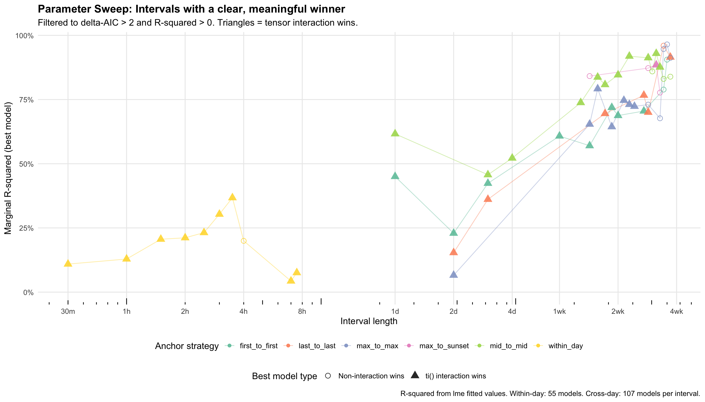

# Parameter Sweep: Timescale Analysis of Monarch Butterfly Cluster Dynamics

## Overview

This analysis systematically explored how the choice of observation interval affects model performance and predictor importance for explaining changes in overwintering monarch butterfly cluster size. Rather than relying on a single pre-selected interval (30 minutes for within-day, ~29 hours for between-day), we tested every feasible interval from 30 minutes to 30 days using the same model sets employed in the primary manuscript analyses.

## Methods

### Pair Construction

**Within-day intervals (30 min – 630 min, step 30 min; 21 intervals):**
Non-overlapping observation pairs were constructed within each deployment-day. For a given interval *I*, each daytime observation was paired with the closest observation *I* minutes later (tolerance: ±*I*/6 minutes). Each observation was used at most once. Weather variables (temperature, wind) were aggregated over each pair's interval. Column names and response variable (`butterfly_difference_cbrt`) match the 30-minute analysis.

**Cross-day intervals (1 – 30 days, step 1 day; 30 intervals):**
Five anchor strategies defined how observations were paired across days:
- **first_to_first**: First daytime observation on day A → first on day A+N
- **last_to_last**: Last daytime observation on day A → last on day A+N
- **mid_to_mid**: Observation closest to midday on day A → closest to midday on day A+N
- **max_to_max**: Observation with highest count on day A → highest count on day A+N
- **max_to_sunset**: Highest count on day A → last observation on day A+N

Weather variables (temp_max, temp_min, wind_max_gust) were aggregated over the full interval between anchor points, including overnight data. The response variable (`butterfly_diff_95th_sqrt`) and column names match the daily analysis.

### Models Tested

**Within-day: 55 models** — the 48 models from `monarch_gam_analysis.qmd` (M1–M48) plus 7 tensor product interaction models (M49–M55) including the `ti(max_gust, butterflies_direct_sun_t_lag)` term from the best model on the fact-check branch.

**Cross-day: 107 models** — the 95 models from `monarch_daily_gam_analysis.qmd` (M1–M50 without baseline, B1–B55 with baseline) plus 7 tensor product interaction models (BT1–BT7) covering `ti(wind, sun)`, `ti(temp, wind)`, and `ti(temp, sun)`.

All models were fit using `gamm()` with REML, random intercept by `deployment_id`, and AR(1) correlation structure where sufficient data existed. A 60-second timeout per model prevented convergence hangs.

### Total Computation

- 28,579 within-day pairs + 9,195 cross-day pairs = 37,774 observation pairs
- 15,066 GAMM model fits
- Runtime: ~15 minutes

## Key Findings

### 1. The wind × sun tensor interaction is robust across within-day timescales

The `ti(max_gust, butterflies_direct_sun_t_lag)` interaction, which was the top model in the original 30-minute analysis, is statistically significant (p < 0.05) at **18 of 21 within-day intervals** tested (30 min through 630 min). At 30–180 min, it is significant at p < 2e-16. The three intervals where it is non-significant (210 min p=0.24, 480 min p=0.10, 570 min p=0.23) appear to be artifacts of how specific observations pair at those intervals rather than a biological signal — adjacent intervals on both sides show strong significance.

**This confirms that the wind × sun interaction finding in the manuscript is not an artifact of the 30-minute interval choice.**

### 2. Wind alone is the weakest standalone predictor at every timescale

Adding wind to a baseline-only model improves AIC by only 3–7 points within-day and 0–3 points cross-day. For comparison, sun exposure improves AIC by 10–24 points within-day, and temp_max improves by 10–37 points cross-day. Wind's predictive power exists almost exclusively through interactions with other variables.

### 3. The dominant interaction shifts across timescales

| Timescale | Dominant interaction | Interpretation |
|-----------|---------------------|----------------|
| 30 min – 3 hours | `ti(wind, sun)` | Real-time thermoregulation — wind modulates solar heating on behavioral timescales |
| 1 – 14 days | `ti(temp, sun)` and `ti(temp_max, wind)` | Cumulative thermal environment — multi-day heat exposure drives population-level change |

Within-day, the wind × sun interaction is highly significant (p < 2e-16). Between days, it is significant only at the 1-day interval (p < 0.05 for all anchor strategies) and sporadically beyond that (~20% of intervals). The `ti(temp_at_max_count, sun)` interaction (BT7) replaces it as the most frequently selected cross-day interaction.

### 4. Baseline butterfly count dominates cross-day predictions

Every winning cross-day model (70/70 interval × anchor combinations within 14 days) includes `s(butterflies_95th_percentile_t_1)`. Marginal R² increases from ~10–50% at 1 day to 60–85% at 2 weeks, but this increase is driven almost entirely by the baseline count term, not by weather variables. Knowing how many butterflies were there before is the strongest predictor of how many will be there next.

### 5. Temperature matters more at longer timescales

Temperature is non-significant at the 30-minute interval (consistent with the manuscript's p = 0.057 finding). It becomes consistently significant at within-day intervals ≥ 90 minutes. Cross-day, `temp_max` is one of the strongest single predictors (+10 to +37 AIC improvement over baseline alone). This suggests temperature operates on a slower timescale than sun or wind — it takes hours to days for ambient temperature effects to manifest in cluster behavior, consistent with the physiological and energetic constraint hypothesis.

### 6. Anchor strategy matters for cross-day comparisons

When the response variable and baseline count properly reflect each anchor point (fixed in v2 of this analysis), the five strategies produce meaningfully different results:

| Anchor strategy | Typical R² at 7 days | Typical R² at 14 days |
|----------------|---------------------|----------------------|
| mid_to_mid | 0.68 | 0.85 |
| max_to_sunset | 0.65 | 0.73 |
| first_to_first | 0.61 | 0.69 |
| last_to_last | 0.66 | 0.65 |
| max_to_max | 0.63 | 0.63 |

`mid_to_mid` and `max_to_sunset` consistently produce the highest R² and the most decisive model selection (largest ΔAIC gaps).

### 7. Model selection is unambiguous within-day, noisier cross-day

Within-day, the best model has ΔAIC > 2 over the runner-up at every interval — there is always a clear winner (and it almost always contains a `ti()` term). Cross-day, 2–6 models are often within ΔAIC < 2, reflecting genuine model uncertainty with smaller sample sizes.

## Summary Figure

*Intervals where the best model wins by ΔAIC > 2 and explains variance (R² > 0). Filled triangles indicate the winning model contains a tensor product interaction. Open circles indicate no interaction in the winning model. Within-day models span 30 min to 10.5 hours. Cross-day models span 1 to 30 days with 5 anchor strategies.*

## Interpretation

This analysis serves as a robustness check for the primary manuscript findings. The central result — that wind affects monarch cluster dynamics only through its interaction with sun exposure, not independently — holds across every within-day timescale tested. The 30-minute interval used in the manuscript is not special; the same pattern emerges at 60, 90, 120, 150, and 180 minutes with even stronger significance.

The timescale transition from wind × sun dominance (hours) to temperature × sun dominance (days) is consistent with the physiological and energetic constraint hypothesis outlined in the manuscript. At behavioral timescales, convective cooling from wind modulates the immediate thermal effects of solar radiation. At population timescales, the cumulative thermal environment (captured by temp_max over multi-day windows) determines whether conditions were persistently warm enough to drive grove-level departure.

## Files

| File | Description |
|------|-------------|
| `build_pairs.py` | Generates within-day and cross-day observation pairs |
| `fit_and_plot.R` | Fits all models, produces plots and results |
| `run.sh` | Orchestrator script |
| `within_day_pairs.csv` | 28,579 within-day pairs across 21 intervals |
| `cross_day_pairs.csv` | 9,195 cross-day pairs across 30 intervals × 5 anchors |
| `results.csv` | All 15,066 model fit results |
| `best_model_curve.csv` | Best model per interval × anchor |
| `sweep_clear_winners.png/pdf` | Summary figure (ΔAIC > 2, R² > 0) |
| `sweep_plot.png/pdf` | Full sweep (all intervals) |
| `sweep_aic_plot.png` | AIC across intervals |
| `delta_aic_gap.png` | ΔAIC between best and runner-up |
| `model_ambiguity.png` | Number of models within ΔAIC < 2 |
| `delta_aic_faceted.png` | ΔAIC gap by anchor strategy |
| `partial_effects_210min_M50.png` | Partial effects for best 210-min model |
| `partial_effects_240min_M23.png` | Partial effects for best 240-min model |
